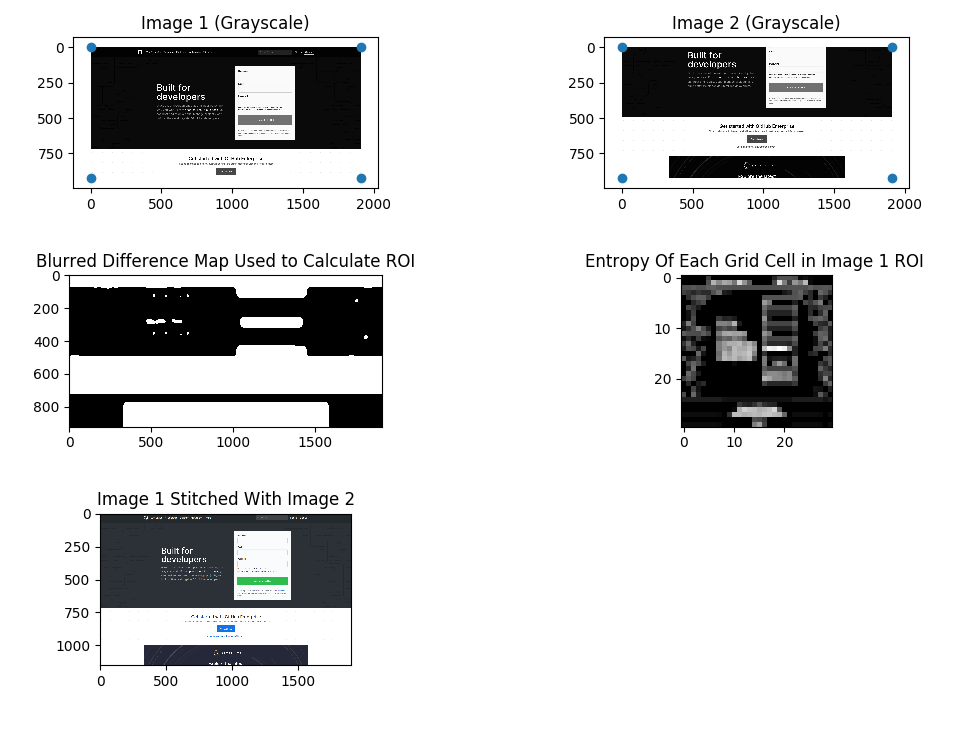

# Dependencies
+ matplotlib - v2.0.0   
+ numpy - v1.13.3 
+ opencv-python - v4.0.1.24

# What is this?
This is a program that takes a sequence of overlapping screenshots and stitches them together to make one big screenshot. Inside the project is a folder `Sample/` which contains 8 screenshots and the final stitched image `composite.png`. To reproduce the results, clone the project and run the following command inside the project directory.

`python image_stitcher.py --path Sample/Shot1.png Sample/Shot2.png Sample/Shot3.png Sample/Shot4.png Sample/Shot5.png Sample/Shot6.png Sample/Shot7.png Sample/Shot8.png --N 30 --votes 35`

Inside the project, there is also `image_stitcher_viz.py` which serves as a visualization program displaying information the stitcher is making use of but in a human readable form. This program is used to debug and tune the algorithm. 

# How to use this program

Format: `python image_stitcher.py [--roi [rectangle]] [--N N] [--votes VOTES] [--path image1 image2 ...]`

+ `--roi`
  + Crops all screenshots with a `rectangle` specified by 4 integers: top left x coordinate, top left y coordinate, width, height. Example: `--roi 100 200 300 400` will crop all images with a rectangle whose top left corner is at `(100, 200)` and whose width and height are `200` and `300`, respectively.
  + If `--roi` is used without specifying a rectangle, the stitcher will automatically calculate a region of interest. Note that the stitcher has a very aggressive cropper and the results may not be optimal.
  + A region of interest (ROI) is specified when screenshots have a "fixed" element that needs removal. For example, the top banner of a website may persist at the top of each image.

+ `--N`
  + The stitcher will automatically calculate a region of interest (ROI) to avoid having "fixed" elements in two screenshots misguide the stitcher when determining the transformation between the two images. Once an ROI is found, the stitcher divides the ROI into an NxN grid. Each cell of the grid is then template matched between the two photos, and once a match has been found, the stitcher calculates the corresponding transformation between the two images.
  + Smaller N's result in larger cells and longer match times; however, more notable features will be matched (eg. faces). Larger N's results in smaller cells and faster match times, but less distinct features will be matched and might misguide the stitcher. Default value is 15.

+ `--votes`
  + When a cell is template matched between two images, a transformation is calculated to stitch the two images together based on the position of the pattern found in both images. Because of template matching inaccuracies, an incorrect transformation may be calculated. To mitigate the event of a incorrect stitch, a voting system is used. The transformation that reaches the specified number of votes first will be the transformation used to stitch two images together. If the specified voting threshold is not met, the transformation with the most votes is chosen. A higher voting threshold will lead to more accurate stitching but at the expense of performance as more transformations are needed to be calculated for voting. Default value is 7.

+ `--path`
  + The list of images being stitched needs to be in order. If the stitcher is given `image1`, `image2`, and `image3`, the stitcher will stitch `image1` and `image2` together then stitch `image3` with the previous composite image. The stitcher cannot stitch an out of order sequence of images.